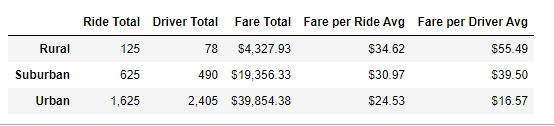

# PyBer Analysis
UCB Bootcamp project, Ridesharing data analysis

## Overview of Analysis
The goal of this analysis is to analyze how different city types vary over different variables. The data was sliced so that we can look at ride totals, drivers, fare totals and fare averages by city type.

## Results

### DataFrame Analysis

As the above dataframe shows, city type correlates with many different metrics. As the city type gets more dense (rural being least dense, and urban being most dense), ride and driver totals go up, while average fare per ride go down, along with the fare per average driver. The increase in quantity outpaces the decrease in average fare, though, meaning that the fare totals for denser areas are higher than for less dense areas. 

### Charting the Fares by City Type Over Time

The line chart above reveals more interesting trends. This visually represents the gap in total fares between different city types, with dense Urban cities bringing the most revenue, suburban centers second, and rural locations bringing in the least in fares. Over time, the three city types do seem to move together, but spikes and dips in different city types are not perfectly correlated. Still, similar spikes in fare total in the last week of February suggest there are global similarities in fare totals over time. 

## Summary

As we have shown in the above summaries, rides are more expensive in rural and suburban areas, and there are fewer drivers. This may discourage or make less accesible the PyBer service in these areas. If we want to increase the availability of rides in these city types, we can look to some specific strategies. 

One  strategy is to encourage more drivers to sign up and look for rides. As the number of available drivers increase, wait times and other obstacles to accessing PyBer services go down. 

Another approach would be to drive down the fare cost in rural and suburban areas. The cost of the ride may be discouraging engagement with our services; lower cost per ride could encourage more rides, which in turn would encourage more drivers to join, and for rides to become less expensive and more availabile. 

A related approach would be to change the algorithm that establishes ride cost in different region. If we, say, charged less per mile in suburban and rural areas, the extra distance that is likely to occur between start and end points is less of a cost factor for customers looking for a ride. While fixed costs can remain similar, it will decrease the impact that lower density has on suburban and rural ride numbers and cost.
